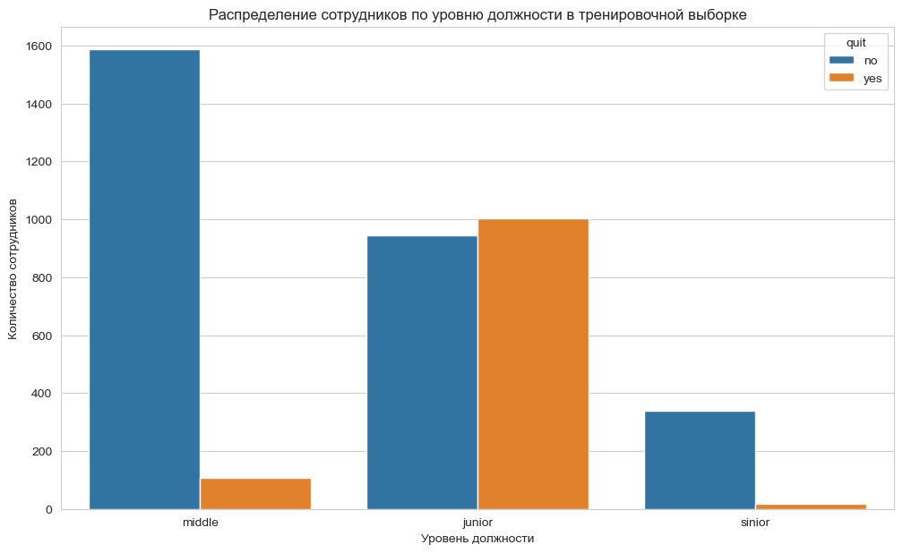
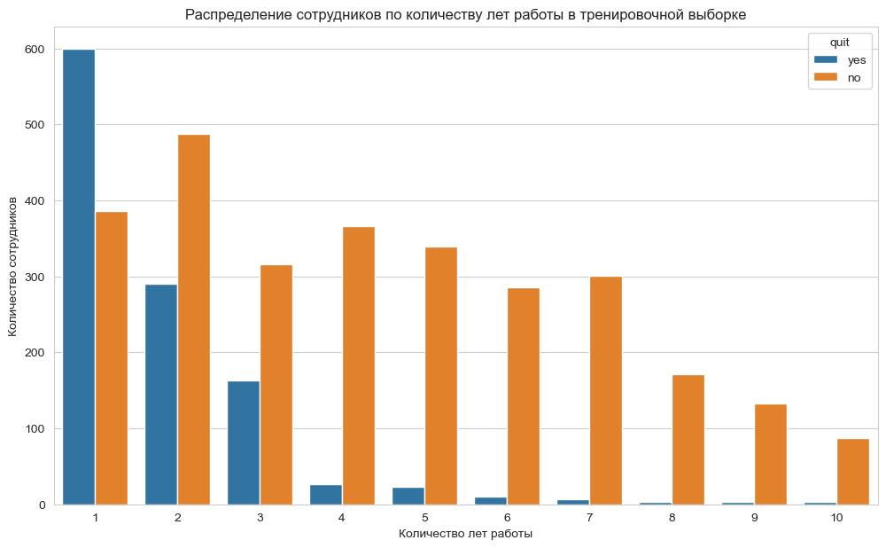
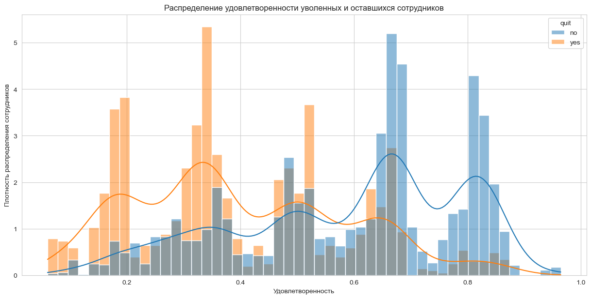

# Прогноз удовлетворённости и увольнения сотрудников

Две модели машинного обучения для HR-аналитики: прогноз удовлетворённости работой и оценка вероятности увольнения сотрудника.

## Executive summary

Для компании «Работа с заботой» решены две связанные задачи. `DecisionTreeRegressor` прогнозирует удовлетворённость сотрудников с **SMAPE = 14,6** на тестовой выборке. `RandomForestClassifier` прогнозирует увольнение с **ROC-AUC = 0,93**.

Анализ показывает, что удовлетворённость сильнее всего связана с оценкой руководителя. Уволившиеся сотрудники в среднем менее удовлетворены работой: около 0,40 против 0,61 у оставшихся. Наиболее заметная группа риска — джуны со стажем 1–3 года, невысокой нагрузкой и без повышения за последний год.

## Основные выводы

1. Большинство сотрудников имеют удовлетворённость в диапазоне 0,6–0,8; наиболее сильная связь целевого показателя наблюдается с оценкой руководителя.
2. Средняя удовлетворённость уволившихся составляет около 0,40, у оставшихся — около 0,61.
3. Среди уволившихся преобладают джуны со стажем 1–3 года; в исследуемых данных у них часто не было повышения за последний год.
4. Модель удовлетворённости достигла **SMAPE = 14,6** на тесте.
5. Модель увольнения достигла **ROC-AUC = 0,93** на тесте.

## Стратегические рекомендации

- Разработать программу адаптации и развития сотрудников первых трёх лет работы, особенно джунов.
- Проверить доступность задач и возможностей роста для сотрудников с низкой нагрузкой.
- Улучшить качество обратной связи руководителей: оценки должны быть понятными, справедливыми и сопровождаться конструктивными рекомендациями.
- Отслеживать сочетание низкой удовлетворённости, отсутствия повышения и короткого стажа как сигнал для проактивной работы HR.
- Проверить, не перегружены ли мидлы и синьоры, если из-за этого джуны остаются без наставничества и содержательных задач.

## Ограничения исследования

- В исходных таблицах присутствовали явные и неявные пропуски, обработанные внутри пайплайнов.
- Тестовые признаки и целевые значения пришлось сопоставлять по `id`, поскольку порядок строк не совпадал.
- Повышения за последний год встречаются редко, поэтому выводы по этому признаку основаны на небольшой группе.
- Анализ выявляет связи, но не доказывает причинность увольнений или удовлетворённости.

## Факты и гипотезы

**Подтверждено данными:** показатели моделей; различия удовлетворённости уволившихся и оставшихся; распределение увольнений по стажу и уровню; корреляции с целевыми признаками.

**Гипотезы для дальнейшей проверки:** джуны могут увольняться из-за недостатка задач, роста или наставничества; качество взаимодействия с руководителем может влиять на удовлетворённость. Для подтверждения нужны интервью, опросы и причинный анализ.

## Ключевые графики

### Увольнения по уровню должности

### Увольнения по стажу

### Удовлетворённость уволившихся и оставшихся

## Методология

1. Проверка и согласование обучающих и тестовых таблиц по идентификатору сотрудника.
2. Исследовательский и корреляционный анализ удовлетворённости, зарплаты, стажа, нагрузки и категориальных признаков.
3. Пайплайны с заполнением пропусков, кодированием, масштабированием и отбором признаков.
4. Сравнение регрессионных моделей по SMAPE для задачи удовлетворённости.
5. Добавление прогнозной удовлетворённости в задачу увольнения и сравнение классификаторов по ROC-AUC.
6. Формирование портрета группы риска и HR-рекомендаций.

## Файлы

- [`Project_for_HR.ipynb`](Project_for_HR.ipynb) — полный анализ и обе модели.

## Технологии

`Python` · `pandas` · `scikit-learn` · `DecisionTreeRegressor` · `RandomForestClassifier` · `phik` · `Matplotlib` · `Seaborn`
